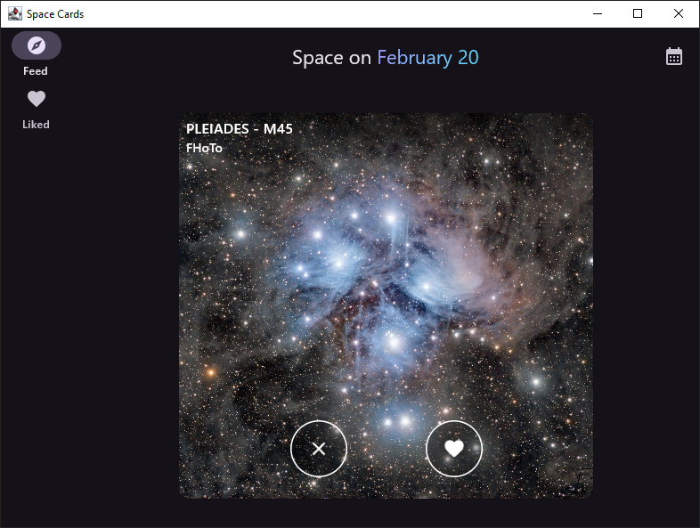
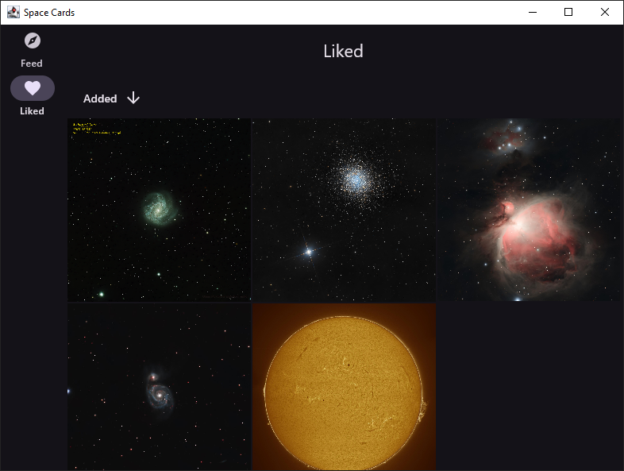

# <p align="center">Space Cards Multiplatform</p>

Marvel at the sheer scale of the Universe with the convenience of your favorite doomscrolling app.
Built with [Compose Multiplatform](https://www.jetbrains.com/compose-multiplatform/), powered by [Astrobin](https://www.astrobin.com/).

https://github.com/user-attachments/assets/63889489-d189-430d-bfae-b34525f708ca

https://github.com/user-attachments/assets/04ae108b-3a93-402a-ab79-a30a283e8105

  

## 🚀 Features

- Fancy Tinder-like UI
- Offline-first approach
- Flexible and scalable implementation of Clean Architecture with minimal boilerplate
- Custom paging solution (because Paging3 is **not** great!)
- Custom MVI-focused ViewModel (the default one is fine — I just wanted to try building my own!)
- Full Android support, basic desktop support (usable but lacks desktop-specific interactions)

## 🔍 Overview

### Architecture

It's an implementation of Clean Architecture, modularized by feature. The project is divided into
feature (UI) and component (domain, data, data source) modules. ViewModels can be injected with
repository interfaces located in the domain directly, avoiding useless use case wrappers around
repository methods when they are not necessary.

#### Sources:

- [The “Real” Modularization in Android by Denis Brandi](https://medium.com/clean-android-dev/the-real-clean-architecture-in-android-modularization-e26940fd0a23)
- [The “Real” Clean Architecture in Android: S.O.L.I.D. by Denis Brandi](https://medium.com/clean-android-dev/the-real-clean-architecture-in-android-part-1-s-o-l-i-d-6a661b103451)
- [How To Avoid Use Cases Boilerplate in Android by Denis Brandi](https://medium.com/clean-android-dev/how-to-avoid-use-cases-boilerplate-in-android-d0c9aa27ef27)
  *(I respectfully disagree with the conclusion, but the article is still great)*
- [The Wrong Abstraction by Sandi Metz](https://sandimetz.com/blog/2016/1/20/the-wrong-abstraction)
- [An in-depth discussion on SOLID and Clean Architecture in the Now In Android project](https://github.com/android/nowinandroid/discussions/1273)

### MVI

A custom MviViewModel ensures all work is paused when the app is in the background, preventing
unnecessary battery drain when polling for geolocation data, remote data sources, etc.

### Paging

> The first rule about Paging3: dont use Paging3

(C) Multiple users on Reddit, aka unexpectedly the only place to offer info on Paging3 beyond the
limited official doc.

I've built a custom paging solution that supports multiple data sources, offline mode, real-time
updates, and both key- and page-based paging. It still has some TODOs, and I wouldn’t claim it's
completely fail-safe, but it should handle most cases you throw at it. For me, it's vastly more
manageable than Paging3.

This solution is available as a separate module, `pager`, in the project. Feel free to copy and
tweak it to your liking, or use it as inspiration for your own implementation.

### Exception handling

Errors that we expect and should handle are represented as a sealed interface hierarchy, wrapped at
the data source level. Other modules are exception-free.

#### Sources:

- [Kotlin and Exceptions by Roman Elizarov](https://elizarov.medium.com/kotlin-and-exceptions-8062f589d07)

### Testing

I got lazy, so no tests!

I have opinions on testing though. Kotest allows for more readable and concise tests, but
historically, its runner has always had issues with Android. To my dismay, this still holds true
even
for [multiplatform modules targeting Android as one of the platforms](https://github.com/kotest/kotest/issues/3651),
so I’d avoid it for now. Instead, I would use Junit5 with just Kotest Assertions.

I would prioritize testing ViewModels with faked data, so that a test encompasses a ViewModel, a
UseCase, a Repository, and potentially even a data source — depending on how you mock them. (For
example, using a manually pre-populated in-memory database for SQLDelight and `MockEngine` for Ktor
Client.) I would consider sprinkling in some screenshot tests. Everything else should ideally be
tested via automated UI tests with no mocks at all.

#### Sources:

- [Mocking isn't evil, but avoid it anyway by Evan Nelson](https://code.cash.app/mocking)
- [When to Mock by Uncle Bob](https://blog.cleancoder.com/uncle-bob/2014/05/10/WhenToMock.html)
- [The Unit Testing Diet: Start with BDD and Do Not Mock by Stelios Frantzeskakis](https://proandroiddev.com/the-unit-testing-diet-1607aac5f434)

## 🛠️ Tech Stack

- [Compose Multiplatform](https://www.jetbrains.com/compose-multiplatform/)
- [Material3](https://m3.material.io/)
- [Coroutines, Flow](https://kotlinlang.org/docs/coroutines-overview.html)
- [Koin](https://insert-koin.io/)
- [SQLDelight](https://cashapp.github.io/sqldelight/)
- [Ktor Client](https://ktor.io/docs/client.html)

## ⚙️ Development Setup

### Code style

This project uses [ktlint](https://pinterest.github.io/ktlint/latest/), integrated via
the [spotless gradle plugin](https://github.com/diffplug/spotless), and a custom code style.
Installing the [ktlint extension](https://plugins.jetbrains.com/plugin/15057-ktlint) for your IDE is
the easiest way to use ktlint. Optionally, you can enable the pre-commit git hook (
`~/spotless/pre-commit`). Installation instructions are inside the file.

### API keys

Get your Astrobin API key and secret [here](https://www.astrobin.com/api/request-key/) and paste
them into `~/.secrets.properties`:

```
ASTROBIN_API_KEY=[...]
ASTROBIN_API_SECRET=[...]
```

## 💙 Special Thanks

- [Astrobin](https://www.astrobin.com/) for serving as the backend for this app
- [Denis Brandi](https://dnsbrnd.medium.com/) for awesome articles on Clean Architecture
- [Quantum fluctuations](https://en.wikipedia.org/wiki/Quantum_fluctuation#/media/File:Quantum_Fluctuations.gif) for originating the large-scale structure of the Universe by introducing a non-uniformity in energy distribution during cosmic inflation

## 📝 License

Distributed under the MIT License. See [LICENSE](LICENSE) for more information.
        


